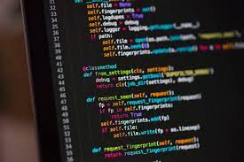

# <nome_do_projeto>
<!---Esses são exemplos. Veja https://shields.io para outras pessoas ou para personalizar este conjunto de escudos. Você pode querer incluir dependências, status do projeto e informações de licença aqui--->



> <Descrição do projeto>
Uma aplicação web de receitas chamada PersonalCheff1 desenvolvida durante o curso de Python no Senac Americana. A aplicação listará receitas e clicando em cada nome de receita você pode ver a receita completa.

### Lista de tarefas
Segue a lista de tarefas a serem desenvolvidas no projeto:
- [X] Pré-requisitos
    - [X] Instalar o Python
    - [X] Instalar Visual Studio Code
- [X] Criar e ativar o ambiente virtual
```
criação e ativação
python -m venv .\venv\
Scripts\activate
```

- [X] Instalar de Django
```
python -m pip install django==3.2
```
- [X] Criar o projeto PersonalCheff1
```
Busca por comandos
django-admin help
django-admin.py help
django-admin.py startproject PersonalCheffProj
```
- [X] Subir o servidor e testar o projeto
```
entrar na pasta do projeto
cd PersonalCheffProj

executar o projeto no servidor 
python manage.py runserver
```
- [X] Criar e ativar o ambiente virtual 
- [X] Subir o servidor e testa o projeto 
- [X] Alterar o idioma do projeto para `pt-br` 

Abrir o arquivo `settings.py` e na linha 106 trocar `en-us` para `pt-br` 

- [X] Alterar o timezone do prpjeto para `America/Sao_Paulo`
Abrir o arquivo `settings.py` e na linha 108 trocar `UTC` para `America/Sao_Paulo`
- [X] Criar o app receitas
```
python manage.py startapp receitas  
```
- [X] Registrar  o app receitas
```
    no arquivo settings.py adicionar o app receitas na lista de apps 
INSTALLED_APPS[
    ...
    'receitas',
]
- [X] Configurar a rota inicial (index)
```
Dentro da pasta receita(app) criar o arquivo urls.py
no arquivo urls.py
    from django.urls import path
    from . import views

    urlpatterns = [
        path('', views.index, name='index')
    ]
```
- [X] Criar a view  para a rota inicial
```
Dentro da pasta receitas(app) abrir o arquivo views.py
    from django.shortcuts import render
    from django.http import HttpResponse

    def index(request):
        return HttpResponse("<h1>Seja bem vindo</h1>")
```
- [] Registrar a rota inicial
- [] Criar arquivo index
-Dentro da pasta receitas(app), criar a pasta 'templetes'
- Dentro da pasta Templetes criar index.html
- No arquivo viwes.py que esta dentro da pasta do app faça a seguinte alteração de codigo:
```
    python
    

```
- []Integrar arquivos estáticos (CSS, JS, IMG)
    - Dentro da Pasta do Projeto (PersonalCheffProj), criar a pasta 'static'
    - Dentro da Pasta Static, colocar as Imagens, os arquivos css e os arquivos js que for utilizar
    - No arquivo  ´settings.py´:
        -realize a importação da biblioteca 'os' atravez do comodo `import os`
        - na linha  ~58 adicione o caminho dos templetes da seguinte forma:
        ```python
          'DIRS': [os.path.join(BASE_DIR, 'receitas/tamplates')],
        ``` 
        - no final do arquivo, após a linha 'STATIC_URL' insira o seguinte código:
        STATIC_ROOT = os.path.join(BASE_DIR, 'static')
        STATICFILES_DIRS =[
            os.path.join(BASE_DIR, 'PersonalCheffProj/static')
        ]
        ```
        - `STATIC_URL`: é a confirmação da rota através do qual os arquivos estaticos seram servidos
        - `STATIC_ROOT`: configuração da pasta de saída (destino) dos arquivos estaticos
        _`STATIC....DIR`

        - na primeira linha do arquivo `index.html` insira ``. Esse comando deve ser usado em todos os qarquivos em que você for utilizar arquivos estaticos.
        - Insira uma img utilizando o comando . Sempre que for utilizar um arquivo estatico voce deve utilizar {% static 'nome-do-arquivo'} 

- [X] Utilizando links
    -Para criar um link na pagina html utilize url 
    <a hraf= "">Pagina inicial</a>
 [X]Criando o base.html
    - na pasta `templetes` crie o arquivo base.html , Esse arquivocontem todo o codigo de estrutura comum à todos as paginas. nesse arquivo deve ficar tudo que tiver do `body` e tudo que tiver depois do `/body`.
    - nesse arquivo de conter o ``
    - nesse arquivo , no local aonde será  carregado o conteudo das outras paginas, deve existir os delimitadores `{ block contente%}` e `
    - o codigo da `base.html` sera algo parecido com:
    ```python
    
<!DOCTYPE html>
<html lang="pt-br">

<head>
    
    <meta charset="UTF-8">
    <meta http-equiv="X-UA-Compatible" content="IE=edge">
    <meta name="viewport" content="width=device-width, initial-scale=1.0">
    <title>PersonalCheff</title>
    <link rel="stylesheet" href="">
    <link rel="shortcut icon" href=""  >
</head>
<body>
    

    

</body>  
</html>
 [X]Separando em partials
 - criar uma pasta chamada `partials` dentro da parta `templetes`
 - dentro da pasta `partials` crie os arquivos que serão as ** partes glogais** utilizadas no seu projeto como `header.html`, footer.html `, etc. No nosso exemplo criamos as partials `header.html `e `fooder.html`
 -inira em cada um dos arquivos seus codigos correspondentes. Exemplo: noa arquivo `header.html` eu insiro todo o controle quero que  seja apresentado no cabeçalho da minha aplicação. não se esqueça do comando `{% load static} 
 - para incluir as partials no arquivos de destinos utilize o comando `include`da seguite maneira:
  
 [ ]Renderizando dados dinamicamente
 [ ]Criando um dicionario com as receitas
 [ ]Criando o banco de dados(MySQL/MariaDB)
 [ ]Instalando o conector do bando de dados MySQL
 [ ]Criando o modelo da receita
 [ ]Criando a migration (mapeamento)
 [ ]Realizando a migration
 [ ]Registrando um modelo no admin
 [ ]Criando um usuário para o ambiente administrativo

´´´
    Projeto padrão do GUTO
static/
    style.css
    app.js
    img/

templetes/
    index.html
    partials/
        heaader.html
        menu.html
        footer.html
´´´        
## 📝 Licença
Esse projeto está sob licença. Veja o arquivo [LICENÇA](LICENSE.md) para mais detalhes.
[⬆ Voltar ao topo](#nome-do-projeto)<br>